# CI/CD pipeline

The release path has one canonical validation workflow and one manual PyPI
publication wrapper. Pull requests, updates to `main`, and release candidates
all execute the same validation definition; publication cannot select a
shorter test path. Two isolated lifecycle workflows refresh dependency
advisories and prune consumed artifacts after a successful run.

The workflows under [`.github/workflows/`](../../.github/workflows/) and the
owned helper map in [`meta/ci/`](../../meta/ci/README.md) are the executable source of truth.
This document records their audit and operating contract.

## Index

- [Pipeline topology](#pipeline-topology)
- [Triggers and stable gate](#triggers-and-stable-gate)
- [Validation coverage](#validation-coverage)
- [Release evidence](#release-evidence)
- [Trust boundaries](#trust-boundaries)
- [External controls](#external-controls)
- [Publication runbook](#publication-runbook)
- [Failures and recovery](#failures-and-recovery)
- [Local reproduction](#local-reproduction)
- [Maintenance and audit](#maintenance-and-audit)

## [Pipeline topology](#index)

```mermaid
flowchart LR
    PR[Pull request to main] --> CI[ci.yml]
    MAIN[Push to main] --> CI
    MANUAL[Manual publish.yml] --> PREFLIGHT[preflight]
    PREFLIGHT --> REUSE[ci.yml through workflow_call]

    CI --> VALIDATION[Canonical validation graph]
    REUSE --> VALIDATION
    VALIDATION --> BUILDS[four platform-specific<br/>wheel producer jobs]
    VALIDATION --> OWNERS[validation-matrix<br/>eight thematic workloads]
    BUILDS -->|each matching wheel| TESTS[four platform-test matrices<br/>three shards each]
    BUILDS --> GATE[validation-gate<br/>certificate verification<br/>+ release assembly]
    TESTS --> GATE
    OWNERS --> GATE

    GATE --> CHECK[CI / validation gate]
    GATE --> ARTIFACT[release-distributions]
    ARTIFACT --> RECONCILE[PyPI reconciliation<br/>no OIDC]
    RECONCILE --> STAGED[manifest-matched<br/>missing packages]
    STAGED --> PUBLISH[code-free publisher]
    PUBLISH --> PYPI[PyPI through OIDC<br/>+ PEP 740 attestations]
    PYPI --> VERIFY[exact files + verified provenance<br/>no OIDC]
    PUBLISH -. success, failure, or skip .-> VERIFY
    RECONCILE --> VERIFY
    RECONCILE --> RELEASEGATE[release-gate<br/>unconditional terminal status]
    PUBLISH --> RELEASEGATE
    VERIFY --> RELEASEGATE
    CHECK -->|direct CI succeeds| CLEANUP[artifact-cleanup.yml<br/>trusted post-run boundary]
    RELEASEGATE -->|Publish succeeds| CLEANUP
    CLEANUP --> RETAINED[Four certified wheel artifacts<br/>retained for seven days]
```



| Workflow | Entry points | Role | External side effects |
|---|---|---|---|
| [`.github/workflows/ci.yml`](../../.github/workflows/ci.yml) | `pull_request`, `push` to `main`, and `workflow_call` | Defines all build, test, security, coverage, packaging, and evidence jobs. | Uploads GitHub run artifacts only. |
| [`.github/workflows/publish.yml`](../../.github/workflows/publish.yml) | `workflow_dispatch` only | Rejects an invalid request, calls `ci.yml` once, reconciles the validated manifest with PyPI, publishes only missing files, verifies the complete remote digest and provenance set, and emits one terminal release status. | Always targets production PyPI after canonical validation. |
| [`.github/workflows/dependency-advisory-refresh.yml`](../../.github/workflows/dependency-advisory-refresh.yml) | Weekly schedule or input-free `workflow_dispatch` | Queries current dependency advisories and compares a reviewable candidate with the committed snapshot. | Uploads one 14-day advisory candidate; never changes repository files. |
| [`.github/workflows/artifact-cleanup.yml`](../../.github/workflows/artifact-cleanup.yml) | Completion of `CI` or `Publish to PyPI`, or trusted manual reconciliation by run ID | After full success, verifies the source run and wheel inventory, then removes every consumed transient or superseded artifact and proves the final four-ID state. | Deletes source-run Actions artifacts and retains four certified wheel bundles. |

The canonical graph has four wheel producers, five matrices, and one terminal job:

| Job | Entries | Dependency | Shared contract |
|---|---:|---|---|
| `platform-wheel-PLATFORM` | 4 independent jobs | None | Build, audit, smoke, certify, and upload one wheel for each release target. |
| `platform-tests-PLATFORM` | 4 matrices × 3 shards | Matching platform-wheel producer | Run the three exhaustive functional shards against each fixed platform wheel and upload one certified evidence set per entry. |
| `validation-matrix` | 8 thematic workloads | None | Run quality, source packaging, certified native coverage, TSan, and four certified platform-sanitizer entries in parallel. |
| `validation-gate` | 1 terminal job | All four producers and five matrices | Require exact success, verify the 12 platform-test sets, four wheel certificates, five sanitizer runs, and native-coverage certificate, then assemble and validate the release set. |

The source-distribution workload is an independent entry in
`validation-matrix`. It builds and validates the sdist while wheel and test work
proceeds. Release assembly is deliberately deferred to `validation-gate`, after
all four wheel producers and five matrix jobs have succeeded.

The validation matrix uses an explicit include list rather than an implicit
Cartesian product because its workloads need different runners, Python
versions, timeouts, and sanitizer settings. Five repository-owned composite
actions contain the workload implementations; conditions select exactly one
of them for each task label. `fail-fast: false` on all five matrices preserves
independent failure evidence. The four intermediate wheel artifact names include
their platform, so concurrently running entries cannot overwrite one another.

There is no independent manual mode in `ci.yml`, no schedule, no TestPyPI
branch, and no check-only publication mode. A safe dry run is a pull request or
`main` validation run, because it exercises the exact release definition
without granting an OIDC token.

## [Triggers and stable gate](#index)

The canonical workflow has these exact triggers:

- `pull_request` targeting `main`, for `opened`, `synchronize`, `reopened`, and
  `ready_for_review` events;
- every `push` to `main`, including a merged pull request;
- `workflow_call`, used only by `publish.yml`.

The cleanup workflow observes completed `CI` and `Publish to PyPI` runs, but its
only job runs after a `success` conclusion. A maintainer may also dispatch it
from the default `main` ref with one positive source run ID to repair a missed
post-run event; the API result must pass the same path, name, event, repository,
attempt, and success checks.
It accepts only pull-request/push CI runs and manually dispatched publication
runs, so a reusable-workflow invocation can never be pruned before its caller
finishes. Its concurrency identity is the source run ID, and it checks the live
run attempt before inventory, before every deletion, and during final
verification. Artifacts newer than the completion event make stale cleanup exit
without modifying the run. This keeps a complete rerun from racing cleanup for
the preceding attempt.

Draft pull requests are not excluded: `opened`, `synchronize`, and `reopened`
events can validate a draft, and `ready_for_review` starts validation when its
state changes. Superseded pull-request runs share a concurrency group and are
cancelled. Every `main` and publication-validation run instead includes its
unique run ID in the group, so GitHub cannot replace an older pending commit.
All manual publication runs share the constant `pypi-production` concurrency
group, regardless of their `release_version`. PyPI production publication is
therefore globally serialized, and a newer dispatch never cancels an active
attempt.

Four wheel producers and five matrix jobs own all validation work. The single terminal
`validation-gate` has direct `needs` edges to all nine upstream jobs, rejects every aggregate
result other than `success`, and only then assembles the release artifact:

| Owner | Contract |
|---|---|
| `platform-wheel-PLATFORM` | Four independent jobs build each release wheel once, certify its native payload, and use one exact artifact name per platform. |
| `platform-tests-PLATFORM` | Four fixed-platform jobs each expand the same three functional shards, producing 12 independent content-addressed evidence sets. |
| `validation-matrix` | Dispatches eight explicitly declared workloads: quality, source distribution and downstream packaging, native LLVM coverage, GCC ThreadSanitizer, and four platform sanitizers. Coverage and sanitizer entries publish compact provenance-bound certificates. |
| `validation-gate` | Checks all nine upstream results, downloads the complete validation inventory once, accepts certificates from the same run and commit at or before the current attempt, validates the exact five-file release set, creates its manifest, and uploads `release-distributions`. |

Repository rules for `main` must require the `CI / validation gate` status. Its
stable identity keeps branch protection independent of matrix expansion and job
display-name changes. The gate uses an always-run condition so a skipped or
failed matrix cannot make the aggregate check disappear. Its result check runs
before any artifact download or assembly command; `failure`, `cancelled`, and
`skipped` are all release-blocking states.

## [Validation coverage](#index)

### Python and functional behavior

The `quality` entry in `validation-matrix` collects branch coverage with three
explicit contexts: `regular`, `adversarial`, and `integration`. The selected suites concentrate on public
I/O, source manifests, cleanup and finalization, cancellation and retry,
remote staging, cloud integration, streaming writers, and recursive Parquet
behavior. The combined report invokes `--fail-under=44`, then independently
checks the exact covered line-and-branch count fraction so display rounding can
never turn a result below 44% into a passing gate.

The 44 percent value is a regression floor for the current deliberately
focused suite, not a coverage target or a claim that every module is 44 percent
covered. Error translation, resource lifecycle, async scheduling, remote
staging, GCS, and both BigQuery owners also have per-module floors in
`report_risk_coverage.py`. HTML, XML, JSON, and the remaining line/branch gaps
remain available for review. Raise floors after a measured clean run; lowering
one requires an explicitly reviewed explanation.

| High-risk module | Minimum |
|---|---:|
| `core_impl/error_translation.py` | 75% |
| `core_impl/resource_lifecycle.py` | 70% |
| `core_impl/async_scheduler.py` | 50% |
| `remote_impl/staging.py` | 70% |
| `remote_impl/providers/gcs.py` | 65% |
| `integrations/bigquery/sidecar.py` | 75% |
| `integrations/bigquery/registry.py` | 48% |

The platform jobs also execute the complete installed-wheel functional suite,
rather than an import from `src/`, on:

| Runner | Release platform | Native safety coverage |
|---|---|---|
| Ubuntu 24.04 / Linux x86-64 | `manylinux_2_27_x86_64.manylinux_2_28_x86_64` | Installed-wheel functional suite; ASan/UBSan extension and libFuzzer campaigns; enforceable LLVM coverage; and GCC TSan executor, extension-domain, and fuzz coverage. |
| Windows Server 2022 / AMD64 | `win_amd64` | Installed-wheel functional suite; MSVC ASan extension smoke, bounded concurrency case, and deterministic standalone fuzz campaigns. |
| macOS 15 / x86-64 | `macosx_11_0_x86_64` | Installed-wheel functional suite; ASan/UBSan extension smoke, fixed three-credit 100-round concurrency and four-credit lane-stealing probes, and deterministic standalone fuzz campaigns. |
| macOS 15 / ARM64 | `macosx_11_0_arm64` | Installed-wheel functional suite; ASan/UBSan extension smoke, fixed three-credit 100-round concurrency and four-credit lane-stealing probes, and deterministic standalone fuzz campaigns. |

Each wheel is built for CPython 3.11 with the stable ABI (`cp311-abi3`). The
complete functional suite runs on the same CPython 3.11 patch and the same
shard-specific selection from one fully locked adapter set on all four
platforms, so timing and behavior comparisons do not silently mix direct,
transitive, or interpreter upgrades. Every shard installs pytest, PyArrow,
DuckDB, pandas, and Polars; `memory-parquet` additionally installs DefusedXML
for its Parquet certificate, while `io-pipeline` owns aiohttp and its transport
closure. Runner evidence records an explicit null for intentionally absent
adapters and fails if a required adapter is absent or an unselected one is
ambiently installed. Those test locks live in
`meta/ci/requirements/platform-tests.txt`. Each shard uses a distinct owned pip
cache identity that also includes runner system, architecture, Python patch,
and both complete dependency inputs, so concurrent shards cannot race to define
one partial cache.
Build, release, sanitizer, and cibuildwheel build/test isolation share the exact
`build-tools.txt` owner lock; Linux containers receive its `/project` path while
host builds receive an absolute workspace path. Every Python artifact is also
bound to the reviewed SHA-256 allowlist in
`python-artifact-sha256.lock`. Pre-commit uses one local `language: system` hook
set owned by the separate exact `pre-commit-hooks.txt` lock. Its repository
dispatcher reuses CI's exact installation or bootstraps one content-addressed
developer environment below `.work`, so it neither mutates the active environment
nor creates independently resolved hook environments.
The dependency audit scans each executable lock independently, statically
requires every declared project, build, and CI-tool dependency to have a
compatible owner pin, and verifies a reviewed snapshot bound to those locks and
`pyproject.toml`. A scheduled or manually requested maintenance workflow queries
live advisory data and uploads a reviewable candidate without making ordinary
snapshot drift a random CI failure. Validation cells use exact interpreter
patches as well. Registry-facing pip subprocesses have bounded process-tree
timeouts. Linux additionally
executes the installed public conversion smoke on
exact 3.12, 3.13, and 3.14 patches, and every platform loads it on the exact
3.14 patch. Linux also probes the wheel and native module on the exact CPython
3.15 release candidate for pull requests, pushes, and release validation, keeping
the topology identical across entry points. Four `platform-wheel-PLATFORM` jobs
define the runner, release platform, cibuildwheel architecture, and wheel artifact
identifier once for each target. Four `platform-tests-PLATFORM` jobs list the exact
12-entry product of those platforms and the `concurrency`, `memory-parquet`,
and `io-pipeline` shards as fixed-platform matrices. Every matrix uses
`fail-fast: false`, preserving evidence from companion entries when one fails.
The canonical validation and publication workflows fix `PYTHONHASHSEED=0`,
enable Python UTF-8 mode, and use UTC; the Linux wheel build passes all three
controls into its cibuildwheel container. They deliberately avoid a global
`LC_ALL` value because no single UTF-8 locale name is portable across all
Windows and macOS runners.

GitHub Actions resolves `needs` at job granularity. Each release platform is
therefore a separate producer job, and each three-shard test matrix depends only
on its matching producer. A platform's tests become runnable as soon as its own
certified wheel exists; a slower architecture cannot impose unrelated idle time.
The four producers still invoke the same composite build contract and retain the
same stable display names and artifact identities.

Each test job uses `if: ${{ !cancelled() }}`. A failed wheel producer therefore
does not prevent matrix expansion: the three shards for platforms with a valid
artifact still execute, while a failed platform's shards emit a clear notice and
finish as clean no-ops. The failed platform-wheel producer and terminal gate
retain the single root-cause failure, without three derivative red jobs. A
cancelled workflow starts no new test work. The four jobs deliberately omit a
dynamic job-level `name`; GitHub can append the shard to their static job IDs
for expanded cells, and a pre-expansion cancellation still displays a static
identifier instead of an unevaluated matrix expression. The always-run
`validation-gate` independently requires all four wheel producers, all four
test-matrix aggregates, and `validation-matrix` to be `success`, so neither
missing tests nor a failed build can permit release assembly.

The functional suite has the same exhaustive, disjoint three-way split on all
four platforms:

| Shard | Test directories | Co-located gates |
|---|---|---|
| `concurrency` | `tests/concurrency` | Threading smoke, the single `native_stress` invocation, and the clean public 8-by-7 release matrix in separate pytest processes. |
| `memory-parquet` | `tests/memory`, `tests/parquet`, and `tests/sinks`, plus the wide fixed-JSONL oracle and standalone-fuzzer golden | Non-gating reader scaling measurement and compiled-wheel Parquet certification. |
| `io-pipeline` | `tests/examples`, `tests/io`, `tests/pipeline`, `tests/remote`, and `tests/schema` | No separate native or timing workload. |

The topology contract derives the repository's test directories and fails if a
new one is not assigned exactly once. The assignment is a static source
contract: CI never redistributes tests from observed runner timings, and every
platform executes the same functional paths. The source-only `tests/quality`
contracts run once in the existing quality job instead of repeating source
scans on four operating systems. Their standalone C++ fuzzer golden remains in
every `memory-parquet` shard because it is the one quality contract that
exercises each platform's real compiler and process model. This preserves
meaningful platform coverage without adding a job or dropping a test. Three shards incur
one more checkout, Python setup, dependency installation, and hosted runner per
platform than the previous two-way split, but reduce the slowest functional
path and run the normal suite concurrently with the benchmark and certificate
workloads. Each test entry downloads only the wheel fixed by its owning
platform job. Each matrix has one exact producer dependency, so its three entries
can start without waiting for unrelated platform builds.

Ordered-executor completion has one canonical functional profile and one
high-volume native stress case. Every platform runs both profiles against its
installed wheel. The ordinary marker selection excludes the explicitly marked
stress case, while the `concurrency` shard runs that case once and writes its
own JUnit and duration reports. The wide fixed-JSONL oracle is assigned to
`memory-parquet`, and the clean public 8-by-7 release matrix runs in its own
process so its integrity evidence cannot be inherited from the larger
functional invocation. This keeps the aggregate workload identical across the
four release targets without multiplying the same 16-worker probe through
unrelated source contracts. Local pytest runs still include both completion
profiles unless a marker expression is supplied.

Every functional-shard invocation emits a JUnit XML report with the duration of
each test and a terminal log ranking the 50 slowest phases above 50 ms. Both
files identify their platform and shard. The log is piped through `tee` with
`pipefail`, so pytest's exit status remains authoritative. Diagnostics remain
in the run logs. Twelve `platform-test-evidence-*` artifacts carry exact
shard-specific inventories and content-addressed certificates through the
terminal gate. Failed or cancelled runs retain them for seven days; a
successful top-level run prunes them after every consumer has finished. The
repository still does not create Job Summaries for these tests.

Functional correctness tests do not treat wall-clock speed as a pass/fail
signal. Deadline behavior is exercised with controlled clocks, exact timeout
arguments and lifecycle state, while concurrency ordering uses events,
barriers and bounded-work counters. A repository contract scans both Python
and native test sources to reject new elapsed-time ceilings, entropy-backed or
unseeded randomness, and vacuous empty-collection assertions. Pytest also
rejects unknown configuration, unknown markers, non-strict xfails, unhandled
thread exceptions, and unraisable exceptions. Other warnings, including known
Python fork deprecations, retain their normal warning behavior.
Timeouts on waits, joins, and external commands remain anti-hang fuses, while
benchmark timing is retained only as diagnostic evidence.

Each test shard also records a runner manifest with the exact Python and reviewed
top-level distribution versions, explicit absence of the other shard-only
adapters, operating-system and architecture identifiers, logical CPU count,
process affinity where supported, and the effective CPU capacity after affinity
and cgroup-v2 quota limits. Linux also records its raw cgroup CPU quota and
throttling counters. Release wheels use one scheduler per generator: Ninja owns
its hardware-aware default width, while Windows keeps one MSBuild project lane
and lets MSVC `/MP` read the effective processor count from the operating
system. This avoids multiplying MSBuild and compiler processes.
The memory-heavier sanitizer and TSan builds remain capped at four tasks and
reduce that width to the effective runner capacity. Hardware supplied by hosted
runners is not identical across architectures, so the manifest distinguishes
an environment difference from a product regression while the software and
test workload stay fixed.

Installed-wheel pytest processes disable third-party plugin autoloading and
fail at startup unless all required common analytical adapters import from the
locked environment and every project module comes from the installed wheel
rather than the checkout. Shard-only roots are version-checked before pytest and
exercised by their owning workloads. The integrity plugin requires clean native
and process ledgers at startup, checks native anomaly counters after each
teardown, and rechecks all ledgers after session fixtures finish. It also
requires exact selected-test counts: 511 for `concurrency`, 1,705 for
`memory-parquet`, 1,025 for
`io-pipeline`, one for `native-stress`, and three for the release matrix.
Platform skips must match reviewed node/reason rules and remain below a
platform-specific ceiling; a runner that can execute more reviewed cases may
produce fewer skips without failing. The resulting process certificates,
JUnit/timing logs, runner manifest, benchmark or Parquet evidence, and outer
job certificate are authenticated together and revalidated by the terminal
gate.

The general functional shards adapt to the capacity reported by each runner,
and their manifests retain the effective affinity and cgroup limits instead of
turning hosted-hardware variation into an admission failure. Native sanitizer
and TSan probes still exercise the reviewed three- and four-credit semantic
paths through explicit test-only capacity overrides and deterministic barriers,
with external watchdogs as anti-hang fuses. macOS sanitizer cells execute 100
semantic concurrency rounds. Windows executes the bounded
`arena_backpressure_deadline` case under MSVC ASan instead of the deeply
threaded full probe. Every native sanitizer also loads the instrumented
extension through its sanitizer-first launcher and runs all four fuzz targets.
External process-tree watchdogs bound the platform probes and every standalone
fuzz campaign; the TSan extension suite uses a bounded watchdog per test domain.

In parallel with the other two shards, `memory-parquet` records one reader
scaling measurement for each installed wheel before its functional tests. The
versioned policy in `benchmarks/readers/linear_scaling_budget.json` is evaluated once,
without pass-on-one-lucky-retry behavior; an exceeded slope or absolute latency
budget emits a warning and remains visible in the JSON report rather than
turning variable hosted-runner timing into a correctness result. Fixture
generation, public conversions, report structure, source provenance, and wheel
identity remain blocking. The report records the commit, platform, package
version, and SHA-256 of the native extension, and isolated Python verifies that
the loaded extension matches the declared wheel. The reader measurement and
threading smoke run before pytest in `memory-parquet` and `concurrency`,
respectively, while `memory-parquet` also performs the Parquet certificate. A
regression therefore fails in its owning shard without serializing unrelated functional suites;
timing changes remain comparable evidence instead of a flaky release gate.

The shared build action pins cibuildwheel and abi3audit. The PEP 517 build
requirements and scikit-build configuration also require exactly CMake 4.3.4,
Ninja 1.13.0, and scikit-build-core 0.11.6, with Make fallback disabled.
Every platform also replaces cibuildwheel's bundled build frontend and Linux
repair tool with the hash-reviewed `build` 1.5.0 and `auditwheel` 6.7.0 from the
repository wheelhouse. After cibuildwheel emits each repaired wheel, CI runs
`abi3audit --strict` explicitly as a blocking gate. This preserves the upstream
stable-ABI check while avoiding its hidden cold-runner download of
`virtualenv.pyz` from release hosting.

Each wheel artifact also carries a provenance-bound native certificate over the
wheel and extension digests. The verifier parses the binary rather than trusting
the tag: Linux must be an x86-64 ELF shared object, each macOS wheel a thin
Mach-O bundle for its declared architecture with exactly the macOS 11.0
deployment floor, and Windows an AMD64 PE32+ DLL with ASLR/DEP flags. The
Windows certificate additionally requires the reviewed runtime-DLL inventory
and digests, closes imports to Python, approved system libraries, and those
bundled runtimes, and binds the reviewed compiler/SDK policy. The terminal gate
requires exactly one matching certificate for each of the four platform wheels
and re-derives it from the downloaded bytes.
Each functional shard admits exactly two direct artifact entries—the wheel and
its matching certificate—and verifies the same SHA/run with a producer attempt
no later than the current attempt before pip may install or import anything. An
artifact still unavailable after two bounded downloads is blocking when its
producer succeeded; a clean no-op is allowed only for a failed, skipped, or
cancelled producer whose root cause remains visible.

### Packaging, dependencies, and security

The distribution gate requires exactly one sdist and four ABI3 wheels with one
version, the expected project name, and the four exact platform tags.
The `source-distribution` task in `validation-matrix` starts independently of
the wheel builds: it checks the source archive, rebuilds exactly one wheel from
it, and validates that wheel as an isolated downstream consumer. The terminal
`validation-gate` waits for that task together with the four wheel producers
and every other validation-matrix entry, verifies all nine aggregate results,
and only then validates the five-file release set and creates the publication
manifest. A failed source or unrelated validation entry therefore prevents
assembly.

The source task byte-compares two clean builds and compares the sdist member
set with the NUL-delimited `git ls-files` inventory after applying the explicit
repository-only exclusions. Missing release-eligible tracked files and extra
members are rejected; the only accepted extras are the six named
build-generated metadata files (`PKG-INFO` plus five
`src/schema_sanitizer.egg-info/*` entries). Its downstream wheel is rebuilt
with the pip cache disabled, preventing a previous local build from satisfying
the check.
Every wheel must contain exactly one `_core_abi3` extension, declare the same
tags in its filename and `WHEEL` metadata, set `Root-Is-Purelib: false`, and
carry one `RECORD` row for every member with the exact SHA-256 digest and size.
The release-set check then requires the exact `cp311-abi3` and platform-tag
inventory rather than accepting a merely installable archive.

Downstream installation exercises `core` and every published runtime extra:
`pyarrow`, `pandas`, `polars`, `duckdb`, `gcs`, `s3`, `azure`, `bigquery`,
`cloud`, and `all`. Its isolated environments resolve through
`meta/ci/requirements/downstream.txt`; the ranges published to users are still
checked, but the canonical CI result cannot change when the package index gains
a new release. The dependency audit resolves runtime, build-system, CI-tool,
and every optional requirement together, then audits each CI lock as its own
environment. Mutually exclusive exact pins are never flattened into an
installation that CI does not actually create. Bandit covers Python
sources and release-authority helpers at low severity and above. A repository
contract fixes the small reviewed `# nosec` allowlist, so a new suppression or
a new low-severity finding is blocking. `detect-secrets` scans tracked files
without credential-verification network calls. Textual CSV, JSON, and XML fuzz
regressions remain in that scan; only binary Parquet, invalid-UTF-8, and
content-addressed archive payloads are excluded because their full byte tree is
enforced separately by `check_fuzz_corpus.py` and its SHA-256 manifest.

Native LLVM coverage is an enforceable release gate, not a report-only metric.
The certificate requires every code-mapped production translation unit and an
exact policy for the two include-only Parquet wrapper units whose executable
regions LLVM attributes to their included fragments. It authenticates every
native source/header/fragment plus the GitHub commit/run/attempt, and compares
integer covered/count fractions without rounded-pass behavior. Aggregate and
high-risk source floors are:

| Native scope | Regions | Functions | Lines | Branches |
|---|---:|---:|---:|---:|
| All production sources | 40% | 60% | 39% | 28% |
| JSON text frontend | 40% | 47% | 40% | 27% |
| Secure read-only file | 77% | 99% | 66% | 49% |
| Memory budget | 60% | 99% | 71% | 44% |
| Memory pool | 69% | 71% | 64% | 49% |
| Operation task arena | 39% | 53% | 42% | 24% |

The native job still renders per-context and combined reports for diagnosis.
Its compact canonical certificate is uploaded and independently rebuilt against
the checked-out source policy by `validation-gate`; it remains downloadable only
when the top-level run does not succeed.

Python coverage is combined only after the regular, adversarial, and integration
data files all exist as the exact expected regular-file set. Strict combination
therefore cannot silently turn one surviving context into a complete report.

Composite actions validate exact runner/platform/toolchain tuples before any
platform-specific condition can turn a typo into a green no-op. They remove
only their owned output roots before the first write, every multi-command Bash
block uses `set -euo pipefail`, and release assembly resets its exact download,
distribution, and manifest destinations. Native linkage certification also
fails when neither `otool` nor `ldd` is available; the absence of an inspection
tool can never print a successful no-Arrow result.

Linux sanitizer setup admits only the runner's exact Clang/LLVM 18.1.3 and
GCC/G++ 14.2.0 executable paths and versions; it does not mutate the runner
package inventory. macOS builds
select Xcode 16.4, SDK 15.5, and its exact AppleClang release; Windows release
builds select VS 2022/v143 and verify its persisted generator cache fields,
generated C and C++ compiler metadata, pinned CMake producer, and sole reviewed
SDK selection. Missing, ambiguous, or changed toolchains therefore fail before
their output can become release evidence.

Every sanitizer workload finishes by serializing its exact runtime options,
suppression policy, platform identity, and watchdog evidence into a canonical
run certificate bound to the GitHub commit, run, and attempt. Across the four
platform sanitizer entries and the TSan entry, the gate requires exactly five
run certificates and 14 raw watchdog certificates: no missing tuple, duplicate,
renamed file, or unreviewed extra is accepted. The TSan policy has no broad
non-instrumented-module suppression, and sanitizer subprocesses are terminated
as process trees when an anti-hang deadline expires.

### Deterministic acceleration

The platform-test shards, validation matrix, and terminal gate restore pip
download caches through one repository-owned action. Each exact key includes
the workload owner, runner operating system and architecture, exact Python
patch, and a SHA-256 digest over the complete regular-file dependency inputs for
that workload. There are no partial restore prefixes. Cache access is allowed
to fail, while the normal locked installation and `pip check` remain mandatory,
so a cache hit can reduce downloads but can never establish correctness or
select dependency versions.
Quality installs the complete hook tool lock once through hash-checking mode,
certifies it, and explicitly enables the dispatcher's current-environment fast
path. Local runs use the same dispatcher and automatically create a hash-verified
cache instead of trusting ambient matching versions. No pre-commit repository
clone or independently resolved hook environment participates in correctness.

Windows wheel builds provision CPython 3.11.9 from a pinned NuGet package before
cibuildwheel starts. An exact-key cache may supply the `.nupkg`, but the action
always verifies its SHA-256, extracts it afresh through the separately verified
NuGet client, rejects links, checks the PE machine as AMD64, and runs the
interpreter to verify its patch, pointer width, and reported architecture. The
wheel log must show that cibuildwheel used this local installation rather than
a mutable NuGet or fallback source. A missing, corrupt, or unavailable cache
therefore falls back to the same digest-verified package path instead of a
different build contract.

Production wheel jobs enable two target-private, Release-only precompiled
headers: one for the standalone core and one for the Python ABI3 module. The
core profile does not inherit `Python.h`. PCH is off by default and is rejected
for sanitizer, coverage, and clang-tidy/include-hygiene configurations; those
diagnostic builds continue to parse each translation unit from its own declared
includes. The optimization changes compilation work, not LTO, ABI auditing,
wheel repair, or the shipped source and test contracts.

The Linux ASan/UBSan cell also uses one explicitly named CMake graph for the
installed extension, sanitized executor, and four libFuzzer targets. It
certifies the graph's compiler, build type, sanitizer, bundled-zlib, fuzzer,
warnings, LTO, and PCH settings before reusing that configured graph and its
shared target outputs for the named native targets. It does not perform a
second configure or accept an unidentified build directory. The same Python
cases, native executor, corpora, and mutation campaigns remain blocking.

Source downstream checks create every isolated consumer with the pinned
`virtualenv` app-data seeder. CI downloads exactly one pinned pip wheel, verifies
its filename and SHA-256, and creates copied environments with network seeding
disabled. Every environment then verifies its Python patch, pointer width, and
pip version before installing its assigned extra. The environments remain
separate, so dependency metadata and imports for one published extra cannot
make another appear valid.

These accelerators preserve the five matrices, four wheel producers, 25-job
execution graph, complete four-platform shard product, coverage contexts,
sanitizer targets, and release-artifact production and verification contracts.
The terminal gate downloads the complete validation artifact inventory with one
bounded retry, validates its exact set, and stages each owner into a fixed local
directory before certificate checks. MSVC defines the standard empty
`Threads::Threads` interface directly because its C++ runtime needs no pthread
link flags; other toolchains retain required CMake thread discovery.
Hosted-runner capacity, network service, and cold-cache state remain variable
external inputs; CI does not impose timing assertions or promise a particular
duration.

## [Release evidence](#index)

Release material and compact evidence needed to independently close the final
gate are uploaded. Every upload fails if its expected files are absent, has an
explicit retention period, and replaces the same owned artifact name on rerun,
then retries once after a transport failure; an exhausted retry is still
blocking. Platform tests, the terminal validation gate, PyPI reconciliation, and the
manual publisher also retry exact downloads after removing only the
corresponding possibly partial destination.

| Artifact | Contents | Retention | Consumer |
|---|---|---|---|
| `dist-wheels-PLATFORM` (4) | One intermediate platform wheel and its native-payload certificate. | Seven days, including after success. | The three shard entries in the matching `platform-tests-PLATFORM` job, `validation-gate`, and post-success wheel review. |
| `platform-test-evidence-PLATFORM-SHARD` (12) | Exact shard-specific runner, JUnit/timing, integrity, benchmark/certificate files, plus their outer content-addressed certificate. | Seven days after a non-successful run; pruned after success. | `validation-gate` and failure diagnosis. |
| `source-distribution` | One validated intermediate sdist. | Seven days after a non-successful run; pruned after success. | `validation-gate` and failed-run recovery. |
| `native-coverage-certificate` | Aggregate and high-risk LLVM floors, translation-unit inventory, source digest, report digest, and run provenance. | Seven days after a non-successful run; pruned after success. | `validation-gate` and failure diagnosis. |
| `sanitizer-certificate-OS-ARCH-SANITIZER` (5) | One run-policy certificate and its exact raw watchdog certificates. | Seven days after a non-successful run; pruned after success. | `validation-gate` and failure diagnosis. |
| `release-distributions` | `packages/` with the exact five distributions plus `release-manifest.json`. | Seven days after a non-successful run; pruned after success. | PyPI reconciliation, verification, failed-release recovery, and in-run audit. |
| `pypi-publish-distributions` | Only manifest-matched files absent from PyPI. | Seven days after a non-successful run; pruned after success. | The code-free OIDC publisher; omitted when PyPI already has the complete matching set. |

Python coverage and the full native HTML/raw reports remain in logs or the
owning runner. Platform JUnit, timing, benchmark, runner, Parquet, and integrity
records remain in their exact per-shard artifacts through final validation and
on non-successful runs. The four wheel-build jobs deliberately retain
cibuildwheel's native GitHub Job Summary; repository actions do not write any
other Job Summary.

A canonical CI run supplies 23 artifacts to the terminal gate: four wheel
bundles, 12 platform-test evidence bundles, five sanitizer certificates, one
native-coverage certificate, and one source distribution. The gate's validated
release bundle is artifact 24, and a manual publication run may add one staging
artifact when publication is required. After the whole top-level workflow
succeeds, `artifact-cleanup.yml` polls for every expected platform-wheel bundle,
requires two stable inventory reads, retains the greatest artifact ID for each
name, and deletes 20 consumed transient bundles for CI or an already-complete
release, or 21 when publication staging exists, plus any superseded same-name
duplicates. A bounded post-delete poll requires two stable reads proving that
exactly those four selected IDs remain. The completed run then exposes exactly
four artifact cards for the
remainder of their seven-day retention: one certified wheel bundle per release
platform. Each retained bundle contains one wheel and its small native-payload
certificate.

Failed and cancelled top-level runs do not delete anything, so diagnostic and
partial-publication recovery inputs keep their configured seven-day retention.
Only the isolated cleanup workflow receives `actions: write`; it checks out no
source and neither downloads nor executes triggering-run content. The cleanup
does not receive automatic events retroactively, but a maintainer can reconcile
an eligible retained successful run by its exact ID. Advisory-refresh artifacts
belong to a different workflow and retain their independent 14-day lifecycle.

The `source-distribution` validation entry builds and exercises the sdist while
platform work is in flight. After every upstream validation job succeeds,
`validation-gate`
downloads and verifies all validation evidence, then validates the immutable
source artifact and four intermediate wheels as one release set. Wheel and
sdist builders derive `SOURCE_DATE_EPOCH` from the checked-out commit,
rather than the runner wall clock. The archive validator requires the canonical
sdist gzip header and every tar member to encode that epoch. The source workload
also builds twice from clean owned directories and byte-compares the sole output
before downstream rebuilding. Repaired wheel ZIP
timestamps are not used as a gate because the independent platform repair tools
do not share one cross-platform timestamp-preservation contract; wheel bytes are
instead bound by the release manifest digests below.

The gate creates a canonical `release-manifest.json` containing:

- format identifier, project, and version;
- the exact Git commit SHA, GitHub run ID, and run attempt;
- the filename, byte size, and SHA-256 digest of every distribution.

The helper validates the packages before creating the manifest and rebuilds the
expected data to verify the serialized manifest. The gate prints its canonical
JSON to the durable job log before upload. `release-distributions` is the only
reconciliation input; publication neither rebuilds nor wildcard-selects
packages. Reconciliation revalidates the remote `main` SHA immediately before
staging, requests cache revalidation from PyPI, validates every existing
filename and SHA-256 against the manifest, rejects unknown, mismatched,
malformed, or yanked files, and atomically stages only missing distributions.
The manifest is outside `packages/`, so it is never sent to PyPI. Its artifact
remains downloadable after a non-successful run; after success its canonical
content remains in the validation-gate log while cleanup removes the transient
release bundle.

GitHub also calculates a digest for the uploaded artifact archive and checks it
on download. That transport digest and the per-file manifest digests have
different scopes: the former protects the GitHub artifact transfer, while the
latter lets an auditor match each eventual PyPI file to the validated release
set.

## [Trust boundaries](#index)

The publication and cleanup workflows deliberately separate code execution
from package-index and artifact-deletion authority:

| Phase | Repository code | Effective authority |
|---|---|---|
| `preflight` | Checks out the selected commit and validates the `main` ref and remote SHA, the requested version against `meta/VERSION`, the PyPI version state, and the explicit confirmation. An existing version is allowed to continue only to post-validation reconciliation. | Read-only Actions metadata and contents; no OIDC token. |
| reusable `validation` | Executes the same `ci.yml` used by PRs and `main`. | Read-only contents and GitHub artifact writes; no OIDC token. |
| `reconcile` | Checks out repository code, downloads `release-distributions`, revalidates the remote `main` SHA, verifies PyPI state against every manifest digest, and stages only missing files. If the matching release is already complete, it emits `publish_required=false` and no staging artifact. | Read-only contents and GitHub artifact writes; no OIDC token. |
| `publish` | Has no checkout, Python setup, or repository-code execution. It runs only for `publish_required=true`, downloads `pypi-publish-distributions` by exact name, and its sole fixed shell step removes only `pypi-publish/` before a transport retry. Exact duplicates from an interrupted attempt are tolerated. | `id-token: write` only, behind the protected `pypi` GitHub Environment whose name is part of the Trusted Publisher identity. |
| `verify` | Runs after publisher success, failure, or skip whenever reconciliation succeeded. It downloads the original `release-distributions`, requires all five unyanked filenames and SHA-256 digests, and cryptographically verifies at least one matching PyPI Publish attestation per file. | Read-only contents; no OIDC token. |
| `release-gate` | Runs unconditionally and accepts only successful reconciliation and verification. It requires `publish=success` when `publish_required=true`, or `publish=skipped` when it is false. | No repository or package-index authority. |
| post-run artifact cleanup | Runs from the default-branch workflow definition after an allowlisted source workflow succeeds, or from the default `main` ref for one maintainer-supplied run ID. It checks out, downloads, and executes no source-run content; validates repository, exact workflow path/name/event, run, attempt, timestamps, and stable wheel availability; keeps the greatest ID per wheel name; and proves the exact four-ID postcondition twice. | `actions: write` only; no contents access or OIDC token. |

Every external action used by workflows or repository-owned composite actions,
including GitHub-maintained actions, is pinned to a full 40-character commit SHA.
Pre-commit has no remote hooks. A nearby version comment
preserves readability. The Dependabot configuration in
`.github/dependabot.yml` checks the `github-actions` ecosystem weekly so an
update arrives as a reviewable commit-pin change. Review upstream release notes
and the pin diff before merging, and never replace a full SHA with a mutable
branch or tag.

ShellCheck and shfmt are local pre-commit hooks with exact `shellcheck-py` and
`shfmt-py` dependency pins. Their supported-platform wheels contain the
executables, so a clean quality runner does not depend on a system installation.
All hook tools share the hash-installed owner lock. The sole source-only wrapper,
`actionlint-py`, is installed without build isolation or cache behind a bounded
retry; its source artifact is hash-locked, its embedded download verifies the
actionlint release digest, and CI checks the resulting binary reports version
1.7.12 before any hook runs. A developer's first plain pre-commit invocation uses
that same bounded installation sequence in the isolated `.work` cache.

PyPI publication uses
[Trusted Publishing](https://docs.pypi.org/trusted-publishers/) instead of a
stored API token. The publisher action obtains a short-lived GitHub OIDC
identity only in the final job. It also publishes
[PEP 740 attestations](https://docs.pypi.org/attestations/) for the distributions.
A PEP 740 attestation binds a distribution digest to the trusted workflow
identity at publication time; `release-manifest.json` instead binds the
validated five-file set to this repository commit and GitHub run. The manifest
recorded in the validation log is internal audit evidence, is not a PEP 740
attestation, and is not itself uploaded to PyPI.

The post-publish verifier installs `pypi-attestations==0.0.30` and its complete
exact, vulnerability-audited compatible dependency lock outside the OIDC job.
The verifier version matches the pinned publisher action, while its transitive
pins are independently kept current. For every local manifest file it consumes
the [PyPI Integrity API](https://docs.pypi.org/api/integrity/), performs
Sigstore/PEP 740 cryptographic verification
against the file bytes, and then requires the PyPI Publish v1 predicate, GitHub
publisher `bgallan/schema-sanitizer`, workflow `publish.yml`, source ref
`refs/heads/main`, and source repository digest equal to the manifest
`git_sha`. Merely decoding or displaying an attestation never satisfies the
gate.

For external callers, publisher action 1.14.2 resolves its exact action ref to
the prebuilt `ghcr.io/pypa/gh-action-pypi-publish` registry tag; it does not
build the action's Dockerfile or install its Python dependencies during the
calling workflow. The action source is commit-pinned, but that registry tag is
not an immutable image digest. Hosted-runner images, registry delivery, PyPI,
Sigstore trust data, and network availability therefore remain external inputs.
Job and request timeouts bound those inputs and all repository checks fail
closed, but the workflow must not be described as bit-for-bit hermetic.

## [External controls](#index)

Workflow files cannot create or verify repository and PyPI administration
settings. The following external configuration is mandatory for the documented
security model:

1. Protect `main` with a GitHub branch rule or ruleset that requires pull
   requests and the `CI / validation gate` status, restricts direct updates, and
   does not permit routine bypasses.
1. Create a protected GitHub Environment named exactly `pypi`, restrict it to
   `main`, and require the repository's release reviewers before deployment.
1. Configure the `schema-sanitizer` project on PyPI with a Trusted Publisher
   whose owner, repository, workflow filename (`publish.yml`), and environment
   name (`pypi`) exactly match the current workflow identity. Do not add a PyPI
   token secret as a fallback.
1. Restrict workflow-setting changes to repository administrators, and include
   changes to `.github/`, `meta/ci/`, packaging metadata, and this document in
   ownership review.

Initial PyPI/reconciliation reads and GitHub API reads make at most three
short attempts. GitHub API transport errors, HTTP 429, and 5xx responses use bounded
backoff. HTTP 403 retries only when GitHub supplies `Retry-After` or reports
`X-RateLimit-Remaining: 0`; official retry/reset timing is honored up to 30 seconds per
attempt, with a short fallback when no reset is supplied. Other 4xx responses and
malformed data fail immediately. The exact remote `main` SHA is read through that
authenticated, retrying API path as well.

Post-publication verification has a different fixed budget because PyPI serves
release JSON with a 900-second CDN max-age and Integrity responses with a
600-second max-age. It requests `no-cache, max-age=0`, records and validates
available `Cache-Control`, `Age`, `Date`, `ETag`, `X-Cache`, and serial
metadata, and observes the remote state at the start and after three fixed
five-minute waits. Only absent files, missing provenance, temporary Integrity
disablement, rate limits, transport failures, and 5xx responses consume that
visibility budget. A digest, filename, yank state, provenance schema,
predicate, publisher, signature, commit, or ref conflict fails immediately.
The verifier job has a 75-minute terminal timeout around those bounded reads
and offline cryptographic verification against the pinned trust data.

The protected `pypi` Environment is part of the publication identity rather
than an optional pause. Its required reviewers, `main` deployment restriction,
the final `publish` job, the offline provenance verifier, and the PyPI Trusted
Publisher must retain the same exact environment name. Configuring only one
side breaks OIDC publication; weakening permissions or adding a long-lived
token is not an acceptable workaround.

## [Publication runbook](#index)

### Prepare the candidate

1. Merge the version change to `main` and wait for its `CI / validation gate`
   status to succeed.

1. Confirm that the version on `main` is the intended release and is not already
   present on PyPI:

   ```bash
   git fetch origin main
   git switch main
   git pull --ff-only origin main
   python meta/ci/release/check_pypi_version.py
   VERSION=$(tr -d '\r\n' < meta/VERSION)
   ```

1. Keep `main` at that SHA until preflight succeeds. It refuses a dispatch whose
   checked-out SHA is no longer the remote head of `main`. Keeping `main`
   unchanged until publication finishes also preserves the option of starting
   a clean replacement run after a validation failure.

### Dispatch and publish

Start `publish.yml` from the `main` ref in the Actions UI, or run:

```bash
gh workflow run publish.yml \
  --ref main \
  -f release_version="${VERSION}" \
  -f confirm_publish='publish schema-sanitizer'
```

Both inputs are required. Preflight fails unless the selected ref is `main`,
`release_version` exactly matches the valid `meta/VERSION`, that version is
either absent from PyPI or present for later manifest reconciliation, `main`
has not moved, and the confirmation phrase is exact. The input is a package
version, not a Git tag. Preflight has no publication credentials and runs
before the expensive reusable validation; it never trusts an existing release
until the newly built manifest can be compared after validation.

After preflight, the workflow invokes the complete reusable `ci.yml`: the same
four wheel producers, five validation matrices, and terminal
`validation-gate` used by pull requests and pushes to `main`. When that gate
succeeds, the non-OIDC reconciliation job compares PyPI with the validated
manifest. A complete matching release ends without a publisher job; otherwise
the privileged job publishes only the staged missing files. In either case,
the final verifier requires the complete remote digest set and one valid
matching publish attestation per file. The unconditional `release-gate` then
checks that publication succeeded exactly when reconciliation required it;
this is the sole terminal release status. The protected `pypi` Environment
supplies the final human approval pause. For the release audit record, retain:

- the workflow URL, dispatch actor, commit, requested version, run ID, and
  attempt;
- all four wheel-producer and five validation-matrix aggregate results plus the
  `validation-gate`, reconciliation, verification, and `release-gate` results;
- the canonical manifest printed in the validation-gate log, including its
  project, version, commit, run provenance, filenames, sizes, and SHA-256
  digests;
- the PyPI release URL, exact published files, and PyPI Integrity provenance
  objects.

The publisher sends only `pypi-publish/` to production PyPI. There is no target
selector. `skip-existing` is enabled narrowly so a failed upload can resume the
same immutable staged bytes; it cannot establish workflow success by itself.
Reconciliation checks existing digests before OIDC authority is granted, and
the no-OIDC verifier checks the complete remote set and cryptographic
provenance afterward. A failed publication keeps `release-distributions` and
any staging artifact for recovery and offline review. After a successful
publication, those transient bundles are pruned only after verification and the
terminal gate finish; the manifest remains in the log and the exact release
files remain on PyPI.

## [Failures and recovery](#index)

- For a failed or cancelled PR or `main` run, cleanup does not run. A failed-job
  rerun can reuse retained diagnostics and successful producer artifacts from
  an earlier attempt of the same run and commit; certificates reject future
  attempts and mismatched provenance. Every owned upload replaces a same-named
  artifact from the earlier attempt. The producer and verifier attempt numbers
  remain part of the record.
- After a successful run has been pruned, a selective rerun of a consumer such
  as `validation-gate` cannot reuse deleted inputs. Use **Re-run all jobs** so
  the complete evidence chain is rebuilt. Cleanup checks the live attempt before
  inventory, throughout deletion, and while proving its postcondition, and it
  refuses artifacts newer than the completion event. Stale cleanup therefore
  does not target a newly started complete attempt.
- For a manual release that has not entered `publish`, a failed-job rerun on the
  same run is supported and retains exact run/commit provenance across producer
  attempts. To abandon that run instead, cancel it and start a complete manual
  run only if no file was uploaded; if `main` moved, validate the version on
  its current head.
- Once `publish` starts, preserve that workflow run and its original
  `release-distributions` bytes. From that point onward the only supported
  recovery is **Re-run failed jobs** on that exact run. The verifier runs even
  when the publisher fails, the publisher tolerates only same-name duplicates,
  and the verifier still requires every remote digest and publish attestation
  to match the original manifest identity. Because that run has not succeeded,
  cleanup leaves all recovery artifacts in place; a later successful attempt is
  pruned only after its terminal gate finishes.
- Do not use **Re-run all jobs** or start a new dispatch to recover a partial
  upload. Those choices rebuild platform wheels; cross-run wheel byte identity
  is not certified across mutable hosted images and toolchain patch revisions.
  A different rebuild digest correctly fails reconciliation against the
  already-published immutable file.
- If only `verify` fails because PyPI visibility lag exceeded its fixed
  15-minute cache budget, choose **Re-run failed jobs**. It reuses the original
  manifest, performs no upload, and lets the terminal gate re-evaluate the
  certified state.
- Reconciliation rejects an unknown filename, a digest mismatch, or an existing
  PyPI file absent from the candidate manifest; verification also rejects
  yanked files and any missing, invalid, or wrong-identity provenance. Do not
  attempt an overwrite. Treat that state as a release incident; if the
  published set cannot match the manifest, use a corrected new version.

Yanking does not erase the historical release. Record the failed run, manifest,
observed PyPI state, decision, and replacement version so the recovery remains
auditable.

## [Local reproduction](#index)

Run the normal source, typing, security-helper, and complete Python gates with:

```bash
python meta/ci/quality/ensure_pinned_pip.py
python -m meta.ci.quality.install_locked_requirements \
  --lock meta/ci/requirements/quality.txt --all
python -m meta.ci.quality.install_locked_requirements \
  --lock meta/ci/requirements/build-tools.txt \
  --packages build auditwheel scikit-build-core cmake ninja
python -m pip install --no-build-isolation --no-deps '.[dev]'
pre-commit run --all-files
pytest -q
```

When changing a hook-tool pin or its bootstrap logic, remove only the disposable
owned cache and prove that a plain cold invocation recreates it without a remote
hook repository or active-environment mutation:

```bash
rm -rf -- .work/pre-commit-tools
PRE_COMMIT_HOME="$(mktemp -d)" pre-commit run --all-files
```

A local full-suite branch report can check the same regression floor:

```bash
coverage erase
coverage run --source=src/schema_sanitizer --branch -m pytest -q
coverage report --fail-under=44
```

The CI job uses the smaller, explicit three-context selection in `ci.yml` to
make risk ownership visible. Copy those commands exactly when investigating a
context-specific gap.

Build and inspect the source distribution and the wheel for the local platform
with:

```bash
python meta/ci/quality/ensure_pinned_pip.py
python -m meta.ci.quality.install_locked_requirements \
  --lock meta/ci/requirements/build-tools.txt \
  --packages build abi3audit cibuildwheel packaging twine \
    scikit-build-core cmake ninja
mkdir -p .work
SOURCE_DATE_EPOCH=$(git show -s --format=%ct HEAD)
export SOURCE_DATE_EPOCH
git ls-files -z > .work/sdist-source-manifest
python -m build --no-isolation --sdist --outdir dist
python -m cibuildwheel --output-dir wheelhouse
python -m abi3audit --strict --report wheelhouse/*.whl
python -m twine check dist/* wheelhouse/*
python meta/ci/release/check_distribution_contents.py \
  --source-manifest .work/sdist-source-manifest dist/*.tar.gz wheelhouse/*.whl
```

A developer machine cannot certify the four-platform release set. In CI, the
`source-distribution` validation task performs the source rebuild and
downstream checks while `validation-gate` adds `--release-set`, requires the
exact five artifacts, and generates the manifest. While a run is active or
after a non-successful completion, an auditor can download
`release-distributions` and revalidate it with the recorded run values:

```bash
python meta/ci/release/release_manifest.py verify \
  --manifest release/release-manifest.json \
  --github-sha "$GITHUB_SHA" \
  --github-run-id "$GITHUB_RUN_ID" \
  --github-run-attempt "$GITHUB_RUN_ATTEMPT" \
  release/packages/*
```

Set the three variables from the manifest and GitHub run under review. After a
successful standalone CI run, copy the canonical manifest from the
validation-gate log, download the four retained wheel bundles, and rebuild the
deterministic sdist from the recorded commit with the locked commands above;
the verification command must reproduce its recorded digest. After a successful
publication, the five exact distribution bytes are available from PyPI. Native
sanitizer, fuzzing, coverage, and downstream helpers are grouped by owner in
[`meta/ci/`](../../meta/ci/README.md); their arguments in `ci.yml` are the
authoritative release configuration because the toolchains and runners are
platform-specific.

## [Maintenance and audit](#index)

- Keep release logic centralized in `ci.yml` and `publish.yml`. Keep live
  advisory maintenance isolated in `dependency-advisory-refresh.yml` and
  artifact deletion isolated in `artifact-cleanup.yml`.
- Keep all four wheel producers and five validation-matrix jobs as direct
  dependencies of `validation-gate`, and keep its visible
  `CI / validation gate` status as the required `main` check.
- Do not use `pull_request_target` for repository code from forks and do not
  grant `id-token: write` outside the final publication job.
- Keep automatic cleanup success-only and allow manual repair only for one
  explicit source run ID, with `actions: write` as its sole permission. It must
  not check out, download, or execute source-run content; before every deletion
  it must reject a stale source attempt, and afterward it must prove that the
  greatest-ID artifact for each of the four exact wheel names is all that
  remains.
- Keep Actionlint and Zizmor as blocking pre-commit checks for workflow schema,
  expressions, permissions, and security regressions.
- Build every release file once. Reconciliation must download
  `release-distributions` by exact name, compare it with PyPI, and stage only
  digest-matched missing files. The OIDC publisher must consume only that named
  staged artifact and must not rebuild, mutate, or wildcard-select packages.
- Keep the three shards in the four fixed-platform test matrices disjoint and
  exhaustive, and preserve the same four platform definitions as the wheel
  producers. Each test matrix must depend only on its matching wheel producer,
  so fast platforms start without waiting for the slowest wheel build.
- Treat 44 percent as a baseline. Extend contextual risk tests and raise the
  floor when coverage improves; do not optimize the metric by excluding
  relevant production modules.
- Keep matrix platforms aligned with the supported wheel tags and compatibility
  policy. Prefer matrices for one shared contract and separate jobs for
  materially different toolchains or failure domains.
- Merge Dependabot action updates only after reviewing upstream provenance and
  release notes. Preserve immutable full-SHA pins.
- Update this document, the workflow topology contracts in
  [`tests/quality/test_ci_workflow_topology.py`](../../tests/quality/test_ci_workflow_topology.py),
  and release-helper tests whenever triggers, jobs, matrices, permissions,
  artifacts, retention, manifest fields, or publication controls change.

For a compact external audit, verify that there are four workflow files;
`publish.yml` is the sole manual release; advisory refresh is the sole scheduled
workflow; cleanup alone uses `workflow_run` and `actions: write`, and its manual
repair requires a source run ID; and `ci.yml` owns the three safe validation
triggers.
Every external `uses` reference must be a full commit SHA, only the final publish
job has OIDC authority, `validation-gate` must depend directly on all nine
aggregate producer and validation jobs, reconciliation must consume the named
validated release artifact, and publication must consume only the conditional
named missing-package artifact.
