# CI/CD pipeline

The repository has exactly two GitHub Actions workflows: one canonical
validation workflow and one manual PyPI publication wrapper. Pull requests,
updates to `main`, and release candidates all execute the same validation
definition; publication cannot select a shorter test path.

The workflows under [`.github/workflows/`](../../.github/workflows/) and the
owned helper map in [`meta/ci/`](../../meta/ci/README.md) are the executable source of truth.
This document records their audit and operating contract.

## Index

- [Pipeline topology](#pipeline-topology)
- [Triggers and stable gate](#triggers-and-stable-gate)
- [Validation coverage](#validation-coverage)
- [Release evidence](#release-evidence)
- [Trust boundaries](#trust-boundaries)
- [External controls](#external-controls)
- [Publication runbook](#publication-runbook)
- [Failures and recovery](#failures-and-recovery)
- [Local reproduction](#local-reproduction)
- [Maintenance and audit](#maintenance-and-audit)

## [Pipeline topology](#index)

```mermaid
flowchart LR
    PR[Pull request to main] --> CI[ci.yml]
    MAIN[Push to main] --> CI
    MANUAL[Manual publish.yml] --> PREFLIGHT[preflight]
    PREFLIGHT --> REUSE[ci.yml through workflow_call]

    CI --> VALIDATION[Canonical validation graph]
    REUSE --> VALIDATION
    VALIDATION --> BUILDS[platform-wheel-builds<br/>four-platform matrix]
    VALIDATION --> OWNERS[validation-matrix<br/>eight thematic workloads]
    BUILDS --> BARRIER[All four wheels complete<br/>slowest-build barrier]
    BARRIER --> TESTS[platform-tests<br/>twelve platform x shard entries]
    BUILDS --> GATE[validation-gate<br/>release assembly]
    TESTS --> GATE
    OWNERS --> GATE

    GATE --> CHECK[CI / validation gate]
    GATE --> ARTIFACT[release-distributions]
    GATE --> PUBLISH[Manual wrapper continues]
    ARTIFACT --> PUBLISH
    PUBLISH --> ENV[Protected pypi environment]
    ENV --> PYPI[PyPI + PEP 740 attestations]
```



| Workflow | Entry points | Role | External side effects |
|---|---|---|---|
| [`.github/workflows/ci.yml`](../../.github/workflows/ci.yml) | `pull_request`, `push` to `main`, and `workflow_call` | Defines all build, test, security, coverage, packaging, and evidence jobs. | Uploads GitHub run artifacts only. |
| [`.github/workflows/publish.yml`](../../.github/workflows/publish.yml) | `workflow_dispatch` only | Rejects an invalid release request, calls `ci.yml` once, and publishes its final artifact. | Always targets production PyPI after approval. |

The canonical graph has three matrices and one terminal job:

| Job | Matrix entries | Dependency | Shared contract |
|---|---:|---|---|
| `platform-wheel-builds` | 4 platforms | None | Build, audit, smoke, and upload one wheel for each release target. |
| `platform-tests` | 12 platform-by-shard entries | Complete wheel matrix | Run the three exhaustive functional shards against all four installed wheels. |
| `validation-matrix` | 8 thematic workloads | None | Run quality, source packaging, native coverage, TSan, and four platform-sanitizer entries in parallel. |
| `validation-gate` | 1 terminal job | All three matrices | Require exact success, assemble and validate the release set, create its manifest, and upload the only publication artifact. |

The source-distribution workload is an independent entry in
`validation-matrix`. It builds and validates the sdist while wheel and test work
proceeds. Release assembly is deliberately deferred to `validation-gate`, after
every matrix has succeeded.

The validation matrix uses an explicit include list rather than an implicit
Cartesian product because its workloads need different runners, Python
versions, timeouts, and sanitizer settings. Five repository-owned composite
actions contain the workload implementations; conditions select exactly one
of them for each task label. `fail-fast: false` on all three matrices preserves
independent failure evidence. Artifact names include their platform, shard, or
validation domain where necessary, so concurrently running entries cannot
overwrite one another.

There is no independent manual mode in `ci.yml`, no schedule, no TestPyPI
branch, and no check-only publication mode. A safe dry run is a pull request or
`main` validation run, because it exercises the exact release definition
without granting an OIDC token.

## [Triggers and stable gate](#index)

The canonical workflow has these exact triggers:

- `pull_request` targeting `main`, for `opened`, `synchronize`, `reopened`, and
  `ready_for_review` events;
- every `push` to `main`, including a merged pull request;
- `workflow_call`, used only by `publish.yml`.

Draft pull requests are not excluded: `opened`, `synchronize`, and `reopened`
events can validate a draft, and `ready_for_review` starts validation when its
state changes. Superseded pull-request runs are cancelled by their concurrency
group. `main` and publication validation runs are not cancelled automatically.
Manual publication runs for the same `release_tag` share a concurrency group,
so an active attempt is not cancelled by another dispatch for that tag.

Three matrix jobs own all validation work. The single terminal
`validation-gate` has direct `needs` edges to all three, rejects every aggregate
result other than `success`, and only then assembles the release artifact:

| Owner | Contract |
|---|---|
| `platform-wheel-builds` | Builds the four release wheels once, with one exact artifact name per platform. |
| `platform-tests` | Expands the Cartesian product of four platforms and three functional shards into 12 independent entries. |
| `validation-matrix` | Dispatches eight explicitly declared workloads: quality, source distribution and downstream packaging, native LLVM coverage, GCC ThreadSanitizer, and four platform sanitizers. |
| `validation-gate` | Checks the three aggregate results, downloads the four wheels and validated sdist, validates the exact five-file release set, creates its manifest, and uploads `release-distributions`. |

Repository rules for `main` must require the `CI / validation gate` status. Its
stable identity keeps branch protection independent of matrix expansion and job
display-name changes. The gate uses an always-run condition so a skipped or
failed matrix cannot make the aggregate check disappear. Its result check runs
before any artifact download or assembly command; `failure`, `cancelled`, and
`skipped` are all release-blocking states.

## [Validation coverage](#index)

### Python and functional behavior

The `quality` entry in `validation-matrix` collects branch coverage with three
explicit contexts: `regular`, `adversarial`, and `integration`. The selected suites concentrate on public
I/O, source manifests, cleanup and finalization, cancellation and retry,
remote staging, cloud integration, streaming writers, and recursive Parquet
behavior. The combined report enforces `--fail-under=44`.

The 44 percent value is a regression floor for the current deliberately
focused suite, not a coverage target or a claim that every module is 44 percent
covered. Error translation, resource lifecycle, async scheduling, remote
staging, GCS, and both BigQuery owners also have per-module floors in
`report_risk_coverage.py`. HTML, XML, JSON, and the remaining line/branch gaps
remain available for review. Raise floors after a measured clean run; lowering
one requires an explicitly reviewed explanation.

| High-risk module | Minimum |
|---|---:|
| `core_impl/error_translation.py` | 75% |
| `core_impl/resource_lifecycle.py` | 70% |
| `core_impl/async_scheduler.py` | 50% |
| `remote_impl/staging.py` | 70% |
| `remote_impl/providers/gcs.py` | 65% |
| `integrations/bigquery/sidecar.py` | 75% |
| `integrations/bigquery/registry.py` | 48% |

The platform jobs also execute the complete pytest suite against the installed
artifact, rather than an import from `src/`, on:

| Runner | Release platform | Native safety coverage |
|---|---|---|
| Ubuntu 24.04 / Linux x86-64 | `manylinux_2_27_x86_64.manylinux_2_28_x86_64` | Full wheel suite, focused extension ASan/UBSan, libFuzzer, LLVM coverage, and GCC TSan. |
| Windows Server 2025 / AMD64 | `win_amd64` | Full wheel suite and MSVC ASan parser fuzzing. |
| macOS 15 / x86-64 | `macosx_11_0_x86_64` | Full wheel suite, ASan/UBSan parser fuzzing, and repeated concurrency probes. |
| macOS 15 / ARM64 | `macosx_11_0_arm64` | Full wheel suite, ASan/UBSan parser fuzzing, and repeated concurrency probes. |

Each wheel is built for CPython 3.11 with the stable ABI (`cp311-abi3`). The
complete suite runs on the same CPython 3.11 patch and the same pinned direct
adapter versions on all four platforms, so timing and behavior comparisons do
not silently mix dependency or interpreter upgrades. Those direct test pins
live in `meta/ci/requirements/platform-tests.txt`, which is also the setup-Python
cache key, so changing the environment invalidates the cache deterministically.
Linux additionally
executes the installed public conversion smoke on 3.12, 3.13, and 3.14, and
every platform loads it on 3.14. `platform-wheel-builds` defines the runner,
release platform, cibuildwheel architecture, and wheel and evidence artifact
identifiers once for each of the four targets. `platform-tests` lists the exact
12-entry product of those four platforms and the `concurrency`,
`memory-parquet`, and `io-pipeline` shards. Every matrix uses
`fail-fast: false`, preserving evidence from companion entries when one fails.

GitHub Actions resolves `needs` at job granularity, not separately for each
matrix entry. Consequently, the 12-entry test matrix starts only after all
entries in `platform-wheel-builds` finish. Any platform build that finishes
early therefore waits at an explicit slowest-build barrier instead of starting
its tests as soon as its own artifact exists. This scheduling cost is accepted
deliberately: the workflow has one build contract and one exhaustive test
contract, and all 12 test entries become runnable together after the barrier.
If any wheel entry fails, GitHub skips the dependent test matrix rather than
running entries for the successful platforms. The always-run `validation-gate`
observes that skipped state and fails before release assembly, so the stable
gate cannot accidentally pass.

The functional suite has the same exhaustive, disjoint three-way split on all
four platforms:

| Shard | Test directories | Co-located gates |
|---|---|---|
| `concurrency` | `tests/concurrency` | Threading smoke and the single `native_stress` invocation. |
| `memory-parquet` | `tests/memory`, `tests/parquet`, `tests/quality`, and `tests/sinks` | Compiled-wheel Parquet certification. |
| `io-pipeline` | `tests/examples`, `tests/io`, `tests/pipeline`, `tests/remote`, and `tests/schema` | Reader linear-scaling benchmark. |

The former `remaining` label meant all directories outside `concurrency` and
`memory`; it was not a lower-priority or optional test class. The explicit new
names make every workload's ownership visible. The topology contract derives
the repository's test directories and fails if a new one is not assigned
exactly once. Separate hosted runners provide real parallelism without
oversubscribing a single runner's native concurrency tests. Three shards incur
one more checkout, Python setup, dependency installation, and hosted runner per
platform than the previous two-way split, but reduce the slowest functional
path and run the normal suite concurrently with the benchmark and certificate
workloads. Each test entry downloads only the wheel selected by its platform
fields. The shared dependency on `platform-wheel-builds` intentionally
introduces the slowest-build barrier described above; it does not serialize the
12 entries after they become runnable.

Ordered-executor completion has one canonical functional profile and one
high-volume native stress case. Every platform runs both profiles against its
installed wheel. The normal suite excludes only the explicitly marked stress
case, while the `concurrency` shard runs that case once and writes its own JUnit
and duration reports. This keeps the workload identical across the four
release targets without multiplying the same 16-worker probe through unrelated
source contract tests. Local pytest runs still include both profiles unless a
marker expression is supplied.

Every functional-shard invocation emits a JUnit XML report with the duration of
each test and a terminal log ranking the 50 slowest phases above 50 ms. Both
files identify their platform and shard and are retained in that shard's
evidence artifact. The log is piped through `tee` with `pipefail`, so pytest's
exit status remains authoritative; when pytest fails, the evidence upload still
runs and preserves the partial diagnostics produced before the failure.

Functional correctness tests do not treat wall-clock speed as a pass/fail
signal. Deadline behavior is exercised with controlled clocks, exact timeout
arguments and lifecycle state, while concurrency ordering uses events,
barriers and bounded-work counters. A repository contract scans both Python
and native test sources to reject new elapsed-time ceilings. Timeouts on
waits, joins and subprocesses remain as anti-hang fuses, and benchmark timing
remains valid evidence; only the calibrated reader policy below turns that
evidence into a performance gate.

Each test shard also records a runner manifest with the exact Python and
installed package versions, operating-system and architecture identifiers,
logical CPU count, and process affinity where supported. Linux adds its cgroup
CPU quota and throttling counters. Hardware supplied by hosted runners is not
identical across architectures, so this manifest distinguishes an environment
difference from a product regression while the software and test workload stay
fixed.

In parallel with the other two shards, `io-pipeline` runs the reader
performance gate once for each installed wheel before its functional tests.
It enforces both normalized growth and the versioned absolute-latency policy in
`benchmarks/readers/linear_scaling_budget.json`; a reader that remains linear
but becomes uniformly slower therefore fails. The static policy identifies its
healthy run and all four platform artifacts, using the slowest median for each
case as the cross-platform reference. The report records the commit, platform,
package version, and SHA-256 of the native extension. CI runs the
benchmark in isolated Python mode and verifies that the loaded extension's
bytes match the extension inside the declared wheel, preventing a checkout or
stale build from satisfying the gate. The reader and threading smokes run
before pytest in `io-pipeline` and `concurrency`, respectively, while
`memory-parquet` performs the Parquet certificate. A regression therefore
fails early in its owning shard without serializing unrelated functional
suites; successful runs retain the same checks and coverage.

The shared build action pins cibuildwheel and abi3audit. After cibuildwheel emits each
repaired wheel, CI runs `abi3audit --strict` explicitly as a blocking gate. This
preserves the upstream stable-ABI check while avoiding its hidden cold-runner
download of `virtualenv.pyz` from release hosting.

### Packaging, dependencies, and security

The distribution gate requires exactly one sdist and four ABI3 wheels with one
version, the expected project name, and the four exact platform tags.
The `source-distribution` task in `validation-matrix` starts independently of
the wheel builds: it checks the source archive, rebuilds a wheel from it, and
validates an isolated downstream consumer. The terminal `validation-gate`
waits for that task together with every other matrix entry, verifies that all
three matrices succeeded, and only then validates the five-file release set
and creates the publication manifest. A failed source or unrelated validation
entry therefore prevents assembly.

Downstream installation exercises `core` and every published runtime extra:
`pyarrow`, `pandas`, `polars`, `duckdb`, `gcs`, `s3`, `azure`, `bigquery`,
`cloud`, and `all`. The dependency audit resolves runtime, build-system, CI-tool,
and every optional requirement. Bandit covers Python sources. `detect-secrets`
scans tracked repository files without credential-verification network calls;
only byte-exact fuzz payloads are excluded because their full tree is enforced
separately by `check_fuzz_corpus.py` and its SHA-256 manifest.

The native coverage reports do not currently impose a numerical percentage
floor. Their value is line/branch visibility across three contexts, alongside
hard pass/fail results from the native tests, fuzz campaigns, ASan, UBSan, and
TSan. This distinction prevents a report-only metric from being mistaken for a
release gate.

## [Release evidence](#index)

All artifact uploads fail if their expected files are absent and have explicit
retention periods. Transport-sensitive wheel, source-distribution, evidence,
and final-release uploads retry once; the retry is still a blocking failure.

| Artifact | Contents | Retention | Consumer |
|---|---|---:|---|
| `dist-wheels-PLATFORM` | One intermediate platform wheel. | 1 day | The three matching shard entries in `platform-tests` and `validation-gate`. |
| `source-distribution` | One validated intermediate sdist. | 1 day | `validation-gate`. |
| `release-distributions` | `packages/` with the exact five distributions plus `release-manifest.json`. | 30 days | Manual publication and external audit. |
| `python-branch-coverage` | Contextual HTML, XML, JSON, and high-risk gap report. | 14 days | Maintainers and auditors. |
| `native-llvm-coverage` | LLVM profiles, summaries, and contextual HTML. | 14 days | Maintainers and auditors. |
| `platform-evidence-PLATFORM-SHARD` | Functional JUnit timings, slowest-phase log, and runner/dependency manifest; the three owning shards also retain native-stress/threading, Parquet-certificate, or reader-benchmark evidence. | 14 days | Maintainers and auditors. |

The `source-distribution` validation entry builds and exercises the sdist while
platform work is in flight. After every matrix succeeds, `validation-gate`
downloads that immutable source artifact and the four intermediate wheels,
then validates the five files as one set. It creates a canonical
`release-manifest.json` containing:

- format identifier, project, and version;
- the exact Git commit SHA, GitHub run ID, and run attempt;
- the filename, byte size, and SHA-256 digest of every distribution.

The helper validates the packages before creating the manifest and rebuilds the
expected data to verify the serialized manifest. `release-distributions` is
therefore the only publication input; publication neither rebuilds nor selects
files with a wildcard. The manifest is outside `packages/`, so it is retained as
evidence but is not uploaded as a Python distribution.

GitHub also calculates a digest for the uploaded artifact archive and checks it
on download. That transport digest and the per-file manifest digests have
different scopes: the former protects the GitHub artifact transfer, while the
latter lets an auditor match each eventual PyPI file to the validated release
set.

## [Trust boundaries](#index)

The manual workflow deliberately separates code execution from package-index
authority:

| Phase | Repository code | Effective authority |
|---|---|---|
| `preflight` | Checks out the selected commit and validates branch, version, tag, tag target, unused PyPI version, protected GitHub environment, and confirmation. | Read-only Actions metadata and contents; no OIDC token. |
| reusable `validation` | Executes the same `ci.yml` used by PRs and `main`. | Read-only contents and GitHub artifact writes; no OIDC token. |
| `publish` | Has no checkout, Python setup, or arbitrary `run` step. It downloads `release-distributions` by exact name and invokes the PyPI action. | `id-token: write` only, scoped to the protected `pypi` environment. |

Every external action used by workflows or repository-owned composite actions,
and every remote pre-commit hook, including GitHub-maintained actions, is pinned
to a full 40-character commit SHA. A nearby version comment
preserves readability. The Dependabot configuration in
`.github/dependabot.yml` checks the `github-actions` ecosystem weekly so an
update arrives as a reviewable commit-pin change. Review upstream release notes
and the pin diff before merging; update pre-commit hook pins deliberately, and
never replace a full SHA with a mutable branch or tag.

ShellCheck and shfmt are local pre-commit hooks with exact `shellcheck-py` and
`shfmt-py` dependency pins. Their supported-platform wheels contain the
executables, so a clean quality runner neither depends on a system installation
nor builds a wrapper that downloads a second binary from release hosting. The
dependency-audit input lists both wrapper packages explicitly even though
pre-commit installs them in isolated environments.

PyPI publication uses
[Trusted Publishing](https://docs.pypi.org/trusted-publishers/) instead of a
stored API token. The publisher action obtains a short-lived GitHub OIDC
identity only in the final job. It also publishes
[PEP 740 attestations](https://docs.pypi.org/attestations/) for the distributions.
A PEP 740 attestation binds a distribution digest to the trusted workflow
identity at publication time; `release-manifest.json` instead binds the
validated five-file set to this repository commit and GitHub run. The manifest
is internal audit evidence, is not a PEP 740 attestation, and is not itself
uploaded to PyPI.

## [External controls](#index)

Workflow files cannot create or verify repository and PyPI administration
settings. The following external configuration is mandatory for the documented
security model:

1. Protect `main` with a GitHub branch rule or ruleset that requires pull
   requests and the `CI / validation gate` status, restricts direct updates, and
   does not permit routine bypasses.
1. Protect `v*` tags against deletion or movement. The workflow validates the
   tag target, but a repository rule provides continuing immutability.
1. Create a GitHub environment named exactly `pypi`. Require an independent
   reviewer, prevent self-review where the plan permits it, and restrict
   deployments to `main`.
1. Configure the `schema-sanitizer` project on PyPI with a Trusted Publisher
   whose owner, repository, workflow filename (`publish.yml`), and environment
   (`pypi`) exactly match GitHub. Do not add a PyPI token secret as a fallback.
1. Restrict workflow-setting and environment-setting changes to repository
   administrators, and include changes to `.github/`, `meta/ci/`, packaging
   metadata, and this document in ownership review.

The preflight reads the GitHub Environment API and fails unless `pypi` has a
reviewer, prevents self-review and administrator bypass, and permits only the
`main` branch through a custom deployment policy. The environment name forms
part of the OIDC trust claim. A missing or mismatched GitHub environment or PyPI
Trusted Publisher must make publication fail; it must not be worked around by
granting a broader token.

## [Publication runbook](#index)

### Prepare the immutable candidate

1. Merge the version change to `main` and wait for its `CI / validation gate`
   status to succeed.

1. From an up-to-date local `main`, create and push a real annotated tag whose
   value is `v` followed by the exact contents of `meta/VERSION`:

   ```bash
   git fetch origin main --tags
   git switch main
   git pull --ff-only origin main
   python meta/ci/release/check_pypi_version.py
   VERSION=$(tr -d '\r\n' < meta/VERSION)
   git tag -a "v${VERSION}" -m "schema-sanitizer ${VERSION}"
   git push origin "v${VERSION}"
   ```

1. Keep `main` at that SHA until preflight succeeds. It refuses a tag that does
   not resolve to the exact dispatch SHA or a remote `main` that has moved;
   never move an existing release tag to follow a later commit. Keeping `main`
   unchanged until publication finishes also preserves the option of starting
   a clean replacement run after a validation failure.

### Dispatch and approve

Start `publish.yml` from the `main` ref in the Actions UI, or run:

```bash
gh workflow run publish.yml \
  --ref main \
  -f release_tag="v${VERSION}" \
  -f confirm_publish='publish schema-sanitizer'
```

Both inputs are required. Preflight fails unless the selected ref is `main`,
`meta/VERSION` is valid and absent from PyPI, `release_tag` is exactly
`vVERSION`, the real tag points to the dispatch SHA, `main` has not moved, the
protected `pypi` environment passes its API audit, and the confirmation phrase
is exact. Preflight has no publication credentials and runs before the
expensive reusable validation.

After the three matrices and `validation-gate` succeed, the `publish` job waits
for the `pypi` environment approval. Before approving, the reviewer should check:

- the dispatch actor, commit, real tag, run ID, and attempt;
- all three aggregate matrix results and the final `validation-gate` result;
- that `release-distributions` contains five packages and one manifest;
- that the manifest project, version, commit, run provenance, filenames, sizes,
  and SHA-256 digests match the candidate.

Approval always sends `release/packages/` to production PyPI. There is no target
selector and `skip-existing` is intentionally disabled. Retain the workflow run
URL, downloaded manifest, PyPI release URL, and PyPI attestation records as the
release audit record.

## [Failures and recovery](#index)

- For a PR or `main` run, a rerun can diagnose a transient runner failure; the
  GitHub attempt number remains part of the record.
- For a manual release that has not entered `publish`, reject or cancel the
  environment deployment. If `main` still points at the tagged candidate, start
  a new complete manual run; if `main` moved, prepare a new version and tag on
  its current head. Do not move the old tag or rewind `main`. Prefer a complete
  new run over “re-run failed jobs” so all artifacts, their manifest, approval,
  run ID, and attempt form one obvious evidence chain.
- Once `publish` starts, do not rerun it blindly. PyPI uploads are not an atomic
  five-file transaction and published filenames cannot be overwritten.
- If no file reached PyPI, investigate the OIDC or service failure. Start a new
  complete run of the same candidate only while it is still the head of `main`;
  otherwise use a new version and tag on the current head.
- If only part of the set reached PyPI, compare every PyPI filename and digest
  with `release-manifest.json`. Do not enable `skip-existing`, overwrite files,
  or move the tag. Yank the incomplete release, increment `meta/VERSION`, create
  a new tag at the corrected `main` commit, and pass the complete pipeline again.

Yanking does not erase the historical release. Record the failed run, manifest,
observed PyPI state, decision, and replacement version so the recovery remains
auditable.

## [Local reproduction](#index)

Run the normal source, typing, security-helper, and complete Python gates with:

```bash
python -m pip install -U pip '.[dev]' \
  coverage pip-audit bandit detect-secrets tomli
pre-commit run --all-files
pytest -q
```

When changing either shell-tool pin, also prove that its isolated environment
can bootstrap without a warm pre-commit cache:

```bash
PRE_COMMIT_HOME="$(mktemp -d)" pre-commit run --all-files
```

A local full-suite branch report can check the same regression floor:

```bash
coverage erase
coverage run --source=src/schema_sanitizer --branch -m pytest -q
coverage report --fail-under=44
```

The CI job uses the smaller, explicit three-context selection in `ci.yml` to
make risk ownership visible. Copy those commands exactly when investigating a
context-specific gap.

Build and inspect the source distribution and the wheel for the local platform
with:

```bash
python -m pip install -U build abi3audit==0.0.26 \
  cibuildwheel==4.2.0 packaging twine
python -m build --sdist --outdir dist
python -m cibuildwheel --output-dir wheelhouse
python -m abi3audit --strict --report wheelhouse/*.whl
python -m twine check dist/* wheelhouse/*
python meta/ci/release/check_distribution_contents.py dist/* wheelhouse/*
```

A developer machine cannot certify the four-platform release set. In CI, the
`source-distribution` validation task performs the source rebuild and
downstream checks while `validation-gate` adds `--release-set`, requires the
exact five artifacts, and generates the manifest. An auditor who downloads
`release-distributions` and checks out its recorded commit can revalidate it
with the recorded run values:

```bash
python meta/ci/release/release_manifest.py verify \
  --manifest release/release-manifest.json \
  --github-sha "$GITHUB_SHA" \
  --github-run-id "$GITHUB_RUN_ID" \
  --github-run-attempt "$GITHUB_RUN_ATTEMPT" \
  release/packages/*
```

Set the three variables from the manifest and GitHub run under review. Native
sanitizer, fuzzing, coverage, and downstream helpers are grouped by owner in
[`meta/ci/`](../../meta/ci/README.md); their arguments in `ci.yml` are the authoritative release
configuration because the toolchains and runners are platform-specific.

## [Maintenance and audit](#index)

- Keep exactly `ci.yml` and `publish.yml`. Add release-blocking checks to
  `ci.yml`, never as a reduced or duplicated implementation in `publish.yml`.
- Keep all three matrices as direct dependencies of `validation-gate`, and keep
  its visible `CI / validation gate` status as the required `main` check.
- Do not use `pull_request_target` for repository code from forks and do not
  grant `id-token: write` outside the final environment-protected job.
- Keep Actionlint and Zizmor as blocking pre-commit checks for workflow schema,
  expressions, permissions, and security regressions.
- Build every release file once. Publication must download
  `release-distributions` by exact name and must not rebuild, mutate, or
  wildcard-select packages.
- Keep the three shards in the 12-entry test matrix disjoint and exhaustive,
  and preserve the same four platform definitions as the wheel matrix. Its
  job-level dependency on the complete wheel matrix is an intentional
  slowest-build barrier; reassess its runtime cost before changing the topology.
- Treat 44 percent as a baseline. Extend contextual risk tests and raise the
  floor when coverage improves; do not optimize the metric by excluding
  relevant production modules.
- Keep matrix platforms aligned with the supported wheel tags and compatibility
  policy. Prefer matrices for one shared contract and separate jobs for
  materially different toolchains or failure domains.
- Merge Dependabot action updates only after reviewing upstream provenance and
  release notes. Preserve immutable full-SHA pins.
- Update this document, the workflow topology contracts in
  [`tests/quality/test_ci_workflow_topology.py`](../../tests/quality/test_ci_workflow_topology.py),
  and release-helper tests whenever triggers, jobs, matrices, permissions,
  artifacts, retention, manifest fields, or publication controls change.

For a compact external audit, verify that there are two workflow files, only
`publish.yml` has `workflow_dispatch`, `ci.yml` owns the three safe triggers,
every external `uses` reference is a full commit SHA, only the final publish job
has OIDC authority, `validation-gate` depends directly on all three matrices,
and publication consumes only the named 30-day release artifact.
